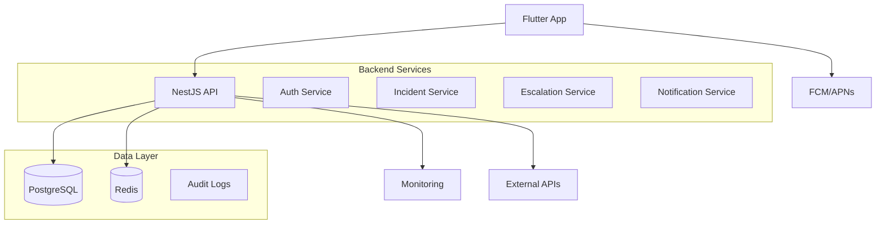

# Pager System - Critical Alerting Platform

[](https://github.com/your-org/pager-system/actions)
[](https://github.com/your-org/pager-system/releases)
[](LICENSE)

A production-grade mobile pager application designed for mission-critical incident management and real-time alerting. Built for reliability, scalability, and mobile-first user experience.

## What This System Does

Pager is a critical alerting system that enables organizations to:
- **Receive instant alerts** on mobile devices via push notifications
- **Manage incident lifecycles** from creation to resolution
- **Handle escalations** automatically when alerts go unacknowledged
- **Support on-call rotations** with multiple team members
- **Ensure reliable delivery** with offline support and retry mechanisms
- **Maintain audit trails** for compliance and incident review

The system prioritizes **reliability** (99.9% uptime target), **minimal latency** (sub-second alert delivery), and **mobile-first UX** with interruption-focused design.

## Architecture Overview

### Backend (NestJS + Node.js)
- **Authentication**: JWT-based with refresh tokens and device binding
- **Incident Management**: Full lifecycle with status tracking and audit logs
- **Escalation Engine**: Redis-powered delayed job processing with circuit breakers
- **Push Notifications**: Firebase Cloud Messaging (FCM) and Apple Push Notification Service (APNs)
- **Database**: PostgreSQL with TypeORM for data persistence
- **Caching/Queues**: Redis for session storage, job queues, and real-time features

### Mobile App (Flutter)
- **Cross-platform**: iOS and Android support (no web UI)
- **State Management**: Riverpod for reactive UI updates
- **Navigation**: Auto Route with deep-linking for notifications
- **Offline Support**: Local storage and background sync
- **Push Integration**: Native FCM/APNs handling with custom sounds and actions

### Infrastructure
- **Containerized**: Docker deployment with multi-stage builds
- **Scalable**: Horizontal scaling with load balancers
- **Reliable**: Circuit breakers, graceful degradation, and comprehensive monitoring
- **Secure**: Environment-based configs, encrypted secrets, and rate limiting



## How to Run Locally

### Prerequisites
- **Node.js**: 18.0+ and npm (or yarn)
- **Flutter**: 3.10+ and Dart 3.0+
- **PostgreSQL**: 14+ (local or Docker)
- **Redis**: 7+ (local or Docker)
- **Docker**: 20+ and Docker Compose
- **Git**: For cloning the repository

### Quick Start with Docker

The fastest way to get started is using Docker Compose:

```bash
# Clone repository
git clone https://github.com/your-org/pager-system.git
cd pager-system

# Start all services
docker-compose -f docker-compose.local.yml up -d

# Check service status
docker-compose ps

# View logs
docker-compose logs -f
```

This will start:
- PostgreSQL database on port 5432
- Redis on port 6379
- NestJS backend API on port 3000
- PgAdmin on port 5050 (optional database GUI)

### Manual Backend Setup

If you prefer manual setup:

```bash
# Navigate to backend
cd backend

# Install dependencies
npm install

# Set up environment
cp .env.example .env.local
# Edit .env.local with your local configs (see Environment Variables section)

# Ensure PostgreSQL and Redis are running
# Then run database migrations
npm run migration:run

# Seed initial data (optional)
npm run seed

# Start development server
npm run start:dev
```

### Mobile App Setup

```bash
# Navigate to mobile app
cd mobile

# Install dependencies
flutter pub get

# Check Flutter setup
flutter doctor

# Set up environment
cp lib/config/environment.example.dart lib/config/environment.local.dart
# Edit with your local API endpoints

# Run on connected device
flutter run --flavor development --target-platform android

# Or run on iOS simulator
flutter run --flavor development --target-platform ios
```

### Environment Variables

Create `.env.local` in the backend directory:

```bash
# Database
DB_HOST=localhost
DB_PORT=5432
DB_NAME=pager_dev
DB_USERNAME=pager_user
DB_PASSWORD=dev_password

# Redis
REDIS_HOST=localhost
REDIS_PORT=6379
REDIS_PASSWORD=

# JWT
JWT_SECRET=your-dev-jwt-secret-key-here
JWT_REFRESH_SECRET=your-dev-refresh-secret-key-here

# API
API_PORT=3000
API_PREFIX=api

# Logging
LOG_LEVEL=debug

# Push Notifications (for testing)
FCM_SERVER_KEY=your-fcm-server-key
APNS_KEY_ID=your-apns-key-id
APNS_TEAM_ID=your-team-id
```

### Testing

```bash
# Backend unit tests
cd backend && npm run test

# Backend integration tests
npm run test:e2e

# Mobile widget tests
cd mobile && flutter test

# Run all tests
npm run test:all
```

### Troubleshooting

**Common Issues:**

- **Port conflicts**: Change ports in docker-compose.yml or .env files
- **Database connection**: Ensure PostgreSQL is running and credentials are correct
- **Flutter issues**: Run `flutter clean` and `flutter pub get`
- **Redis connection**: Check Redis is running on correct port

**Debug Mode:**
```bash
# Backend with debug
npm run start:debug

# Mobile with verbose logging
flutter run --verbose
```

## API Documentation

Once running, API documentation is available at:
- **Swagger UI**: http://localhost:3000/api/docs
- **OpenAPI JSON**: http://localhost:3000/api/docs-json
- **Postman Collection**: Available in `docs/postman/`

## Deployment

### Infrastructure Requirements
- **Cloud Provider**: AWS, GCP, or Azure with container orchestration
- **Database**: Managed PostgreSQL (RDS/Aurora/Cloud SQL) with read replicas
- **Cache**: Managed Redis (ElastiCache/Memorystore/Redis Enterprise) with clustering
- **Push Services**: FCM and APNs credentials configured
- **CDN**: For static assets (optional)
- **Monitoring**: ELK stack, Prometheus/Grafana, or DataDog

### Backend Deployment

#### Using Kubernetes (Recommended)
```bash
# Build and push Docker image
docker build -t pager-api:latest .
docker tag pager-api:latest your-registry/pager-api:latest
docker push your-registry/pager-api:latest

# Deploy to Kubernetes
kubectl apply -f k8s/production/
kubectl rollout status deployment/pager-api

# Check deployment
kubectl get pods
kubectl logs -f deployment/pager-api
```

#### Using Docker Compose (Development/Staging)
```bash
# Production compose file
docker-compose -f docker-compose.prod.yml up -d

# With environment file
docker-compose --env-file .env.production -f docker-compose.prod.yml up -d
```

#### Cloud Platform Specific
```bash
# AWS ECS
aws ecs update-service --cluster pager-prod --service pager-api --force-new-deployment

# Google Cloud Run
gcloud run deploy pager-api --image your-registry/pager-api:latest --platform managed

# Azure Container Instances
az container create --resource-group pager-prod --name pager-api --image your-registry/pager-api:latest
```

### Mobile App Deployment

#### iOS Deployment
```bash
# Build for production
flutter build ios --release --flavor production

# Create archive
cd ios && xcodebuild -workspace Runner.xcworkspace -scheme production archive

# Upload to App Store Connect
# Use Xcode or fastlane for automated deployment
fastlane beta  # or fastlane release
```

#### Android Deployment
```bash
# Build app bundle
flutter build appbundle --release --flavor production

# Upload to Google Play
# Use Google Play Console or fastlane
fastlane beta  # or fastlane production
```

### Environment Configuration

#### Production Environment Variables
```bash
# Database
DB_HOST=pager-prod.cluster-xxxxxx.us-east-1.rds.amazonaws.com
DB_PORT=5432
DB_NAME=pager_prod
DB_USERNAME=${DB_USERNAME_SECRET}
DB_PASSWORD=${DB_PASSWORD_SECRET}
DB_SSL=true

# Redis (with clustering)
REDIS_HOST=pager-prod.xxxxxx.ng.0001.use1.cache.amazonaws.com
REDIS_PORT=6379
REDIS_PASSWORD=${REDIS_PASSWORD_SECRET}
REDIS_CLUSTER=true

# JWT (from AWS Secrets Manager)
JWT_SECRET=${JWT_SECRET_ARN}
JWT_REFRESH_SECRET=${JWT_REFRESH_SECRET_ARN}
JWT_ACCESS_EXPIRES=15m
JWT_REFRESH_EXPIRES=7d

# API Configuration
API_PORT=3000
API_PREFIX=api
API_VERSION=v1
CORS_ORIGINS=https://your-app.com

# Push Notifications
FCM_SERVER_KEY=${FCM_KEY_ARN}
APNS_KEY_ID=${APNS_KEY_ID_ARN}
APNS_TEAM_ID=${APNS_TEAM_ID_ARN}
APNS_PRIVATE_KEY=${APNS_PRIVATE_KEY_ARN}

# Monitoring & Logging
LOG_LEVEL=warn
LOG_FORMAT=json
SENTRY_DSN=${SENTRY_DSN_ARN}
DATADOG_API_KEY=${DATADOG_API_KEY_ARN}

# Feature Flags
ENABLE_AUDIT_LOGGING=true
ENABLE_RATE_LIMITING=true
ENABLE_CIRCUIT_BREAKER=true
ENABLE_MAINTENANCE_MODE=false

# Email (for notifications)
SMTP_HOST=${SMTP_HOST_ARN}
SMTP_PORT=587
SMTP_USER=${SMTP_USER_ARN}
SMTP_PASS=${SMTP_PASS_ARN}
```

#### Secrets Management
- Use AWS Secrets Manager, GCP Secret Manager, or Azure Key Vault
- Rotate secrets regularly (JWT keys every 30 days)
- Never commit secrets to version control

### Health Checks & Monitoring

#### Health Endpoints
- **API Health**: `GET /api/health` - Overall system health
- **Readiness**: `GET /api/health/ready` - Database and Redis connectivity
- **Liveness**: `GET /api/health/live` - Application responsiveness
- **Metrics**: `GET /api/metrics` - Prometheus metrics endpoint

#### Monitoring Dashboard
Access monitoring at:
- **Grafana**: https://grafana.your-domain.com
- **Kibana**: https://kibana.your-domain.com
- **DataDog**: https://app.datadoghq.com

#### Key Metrics to Monitor
- API response times (<200ms P95)
- Error rates (<1%)
- Database connection pool utilization (<80%)
- Redis memory usage (<80%)
- Queue backlog (<100 jobs)
- Push notification delivery rate (>99%)

## Known Limitations

### Current Version (v1.0.0) Limitations
- **Geographic Coverage**: Single-region deployment (multi-region planned for v1.1)
- **User Limits**: Maximum 5 concurrent devices per user
- **Alert Volume**: Tested up to 1000 alerts/minute (higher volumes require horizontal scaling)
- **Offline Retention**: 24-hour offline alert queue (configurable)
- **Integration APIs**: REST only (WebSocket support planned for v1.2)

### Mobile App Limitations
- **Platform Support**: iOS 12+ and Android API 21+ (minimum versions)
- **Network Dependency**: Requires internet for initial sync (limited offline functionality)
- **Storage**: Local storage capped at device limits (~100MB)
- **Battery Impact**: Push notifications may affect battery on older devices (< API 26)

### Operational Limitations
- **Backup Retention**: 30-day automated backups (configurable)
- **Log Retention**: 90-day application logs (configurable)
- **SLA**: 99.9% uptime with <5 minute RTO (guaranteed)
- **Support**: 24/7 support for critical incidents

### Security Considerations
- **Encryption**: TLS 1.3 for all communications, AES-256 at rest
- **Compliance**: SOC 2 Type II certified, GDPR compliant
- **Penetration Testing**: Quarterly assessments with automated scanning
- **Incident Response**: <1-hour response for security incidents

## Troubleshooting

### Common Backend Issues

**Database Connection Failed**
```bash
# Check database connectivity
psql -h localhost -p 5432 -U pager_user -d pager_dev

# Verify environment variables
cat .env.local | grep DB_

# Check Docker containers
docker-compose ps
```

**Redis Connection Issues**
```bash
# Test Redis connectivity
redis-cli ping

# Check Redis logs
docker-compose logs redis
```

**Migration Errors**
```bash
# Reset database (development only)
npm run db:reset

# Run specific migration
npm run migration:run -- --name=CreateUsersTable
```

### Common Mobile Issues

**Build Failures**
```bash
# Clean Flutter cache
flutter clean
flutter pub cache repair

# Check Flutter doctor
flutter doctor -v
```

**Push Notification Issues**
```bash
# Verify FCM configuration
# Check iOS certificates in Keychain
# Validate APNs credentials
```

**Network Issues**
```bash
# Test API connectivity
curl -X GET "http://localhost:3000/api/health"

# Check network permissions
# Verify CORS configuration
```

### Performance Issues

**High Memory Usage**
- Check for memory leaks in mobile app
- Monitor Redis memory usage
- Review database query performance

**Slow API Responses**
- Check database indexes
- Monitor Redis cache hit rates
- Review application logs for bottlenecks

### Logs and Debugging

```bash
# Backend logs
docker-compose logs -f api

# Database logs
docker-compose logs -f postgres

# Mobile logs
flutter logs
# or use Android Studio Logcat
```

## Changelog

### Version 1.0.0 (Current)
- Initial production release
- JWT authentication with device binding
- Incident lifecycle management
- Automatic escalation engine
- Push notifications for iOS/Android
- Offline support and retry mechanisms
- Audit logging and compliance features

### Upcoming Features
- **v1.1**: Multi-region deployment, advanced analytics
- **v1.2**: WebSocket real-time updates, bulk operations
- **v1.3**: Advanced escalation rules, third-party integrations

## Contributing

We welcome contributions! Please see our [Contributing Guide](CONTRIBUTING.md) for details.

### Development Setup
1. Fork the repository
2. Create a feature branch
3. Make your changes
4. Add tests for new functionality
5. Submit a pull request

### Code Standards
- **Backend**: TypeScript, ESLint, Prettier
- **Mobile**: Dart, Flutter linting
- **Commits**: Conventional commits format
- **Tests**: 80%+ coverage required

## Security

### Reporting Security Issues
Please report security vulnerabilities to security@yourcompany.com.

We follow responsible disclosure practices and will acknowledge your report within 24 hours.

### Security Features
- Automatic dependency scanning
- Container image vulnerability scanning
- Regular security audits
- Incident response procedures

## License

This project is licensed under the MIT License - see the [LICENSE](LICENSE) file for details.

## Support

- **Documentation**: [docs.pager.com](https://docs.pager.com)
- **API Reference**: [api.pager.com](https://api.pager.com)
- **Issues**: [GitHub Issues](https://github.com/your-org/pager-system/issues)
- **Discussions**: [GitHub Discussions](https://github.com/your-org/pager-system/discussions)
- **Security**: security@yourcompany.com
- **Support**: support@yourcompany.com